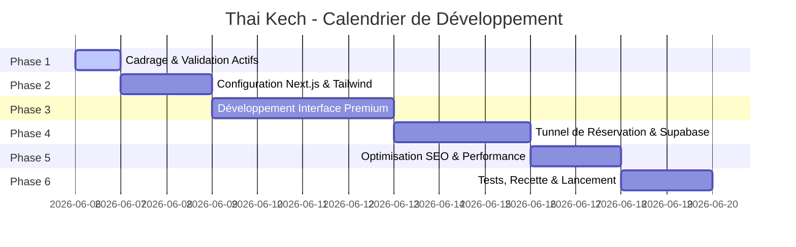

# Thai Kech — Projet de Développement & Plan d'Action
*Plan d'exécution étape par étape, de la structure au lancement*

Ce document sert de liste de contrôle principale pour le projet **Thai Kech** (Spa mobile de luxe à Marrakech). Il est rédigé en français et optimisé pour le marché touristique francophone.

---

## 1. Jalons du Projet (Milestones)

---

## 2. Liste des Tâches Détaillées

### Phase 1 : Cadrage, Contenu & Actifs (Terminé)
*   [x] Définir l'identité visuelle et la palette de couleurs (`design.md` mis à jour)
*   [x] Structurer l'architecture des pages et le parcours utilisateur (`architecture.md` mis à jour)
*   [x] Établir la matrice de mots-clés SEO ciblés en français (`seo_strategy.md` mis à jour)
*   [x] Valider les tarifs (entre 300 et 600 MAD) et les 4 services de démonstration sans paramètre de durée
*   [x] Intégrer les coordonnées de contact (Téléphone : `+212 771-610656`, E-mail : `iliassaariba01@gmail.com`, 24h/7) et la zone de couverture (Marrakech et ses environs)
*   [x] Récupérer le logo fourni par l'utilisateur et spécifier les images haute qualité à générer

### Phase 2 : Configuration Technique & Bases Stylistiques (En cours)
*   [ ] Initialiser le projet Next.js avec TypeScript et Tailwind CSS dans le répertoire de travail
*   *   Utiliser `npx create-next-app@latest` avec les options adéquates
*   [ ] Configurer la structure de dossiers standard (`/src/app`, `/src/components`, `/public`)
*   [ ] Déclarer les variables de couleurs personnalisées dans la configuration Tailwind/CSS (Deep Bamboo Green, Lotus Linen, Temple Gold)
*   [ ] Importer les typographies premium de Google Fonts (Cinzel et Outfit)
*   [ ] Configurer le client Supabase avec les variables d'environnement (`.env.local`)

### Phase 3 : Développement de l'Interface UI Premium (Français)
*   [ ] **En-tête de Navigation (Navbar) :** Logo à gauche, liens fluides (Services, Concept, Avis), bouton d'appel à l'action "Réserver" à droite. Effet flou (frosted glass) au défilement.
*   [ ] **Section Hero :** Image de fond luxueuse (riad avec piscine), slogan percutant en français, et bouton "Réserver un Massage".
*   [ ] **Grille des Services (4 Cartes Premium) :**
    *   Affichage d'une image haute qualité par service.
    *   Titre du service, prix fixe (MAD), description courte et inspirante.
    *   Bouton "Choisir ce service" qui redirige vers le formulaire.
*   [ ] **Section Concept & Déroulement :** Explication étape par étape du service à domicile/riad (arrivée du thérapeute avec table, huiles, musique d'ambiance).
*   [ ] **Pied de page (Footer) :** Contact d'urgence (+212 771-610656, 24h/7), e-mail de support, et liens légaux.

### Phase 4 : Formulaire de Réservation & Intégration Supabase
*   [ ] Créer la page de réservation `/book` ou le composant dédié :
    *   *Étape 1 :* Choix du service (pré-sélectionné si clic depuis la page d'accueil).
    *   *Étape 2 :* Saisie des coordonnées (Nom complet, Téléphone WhatsApp, E-mail).
    *   *Étape 3 :* Sélection de la date (Calendrier interactif) et de l'heure.
*   [ ] Connecter le formulaire à Supabase pour enregistrer automatiquement la réservation dans la table `bookings`.
*   [ ] Créer la page de succès `/book/success` avec un message rassurant indiquant qu'un conseiller va contacter le client sous peu par e-mail ou téléphone, et un bouton de redirection rapide WhatsApp.

### Phase 5 : Optimisation SEO Technique & Performance
*   [ ] Balises meta de titre et description optimisées pour le référencement français.
*   [ ] Injection de données structurées (JSON-LD LocalBusiness) avec couverture Marrakech 24h/7.
*   [ ] Conversion et compression de toutes les images générées au format WebP/AVIF.
*   [ ] Validation des Core Web Vitals (temps de chargement < 1.5s).

### Phase 6 : Validation, Tests & Lancement
*   [ ] Valider le parcours de réservation complet (de la sélection à l'insertion en base).
*   [ ] Vérifier la réactivité mobile sur simulateur (iPhone, Android).
*   [ ] Lancer le projet en mode de production local (`npm run build`).
